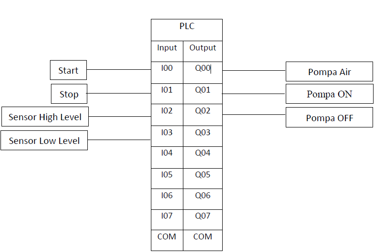
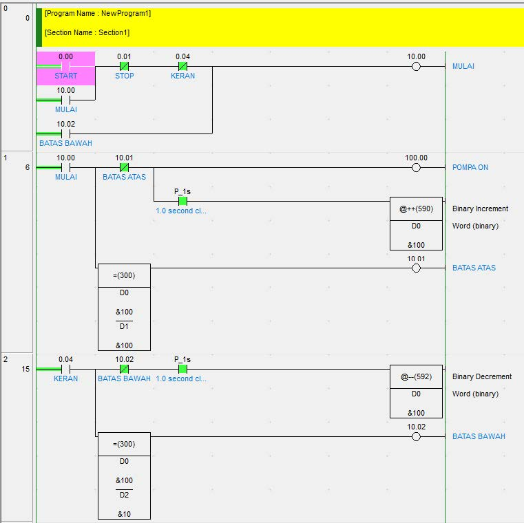
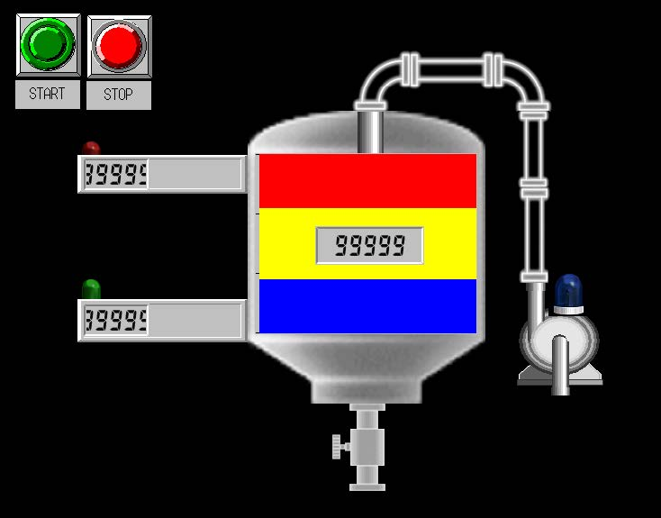
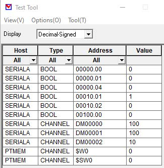

# PLC-Omron-Automatic-Sump-System
PLC Omron Explanation of the automatic sump system by CX-Programer, CX-Designer, On CX-One;

## Project
How to program PLC with CX-Programmer 
[Explanation about project PLC](https://youtu.be/Ltjh9YDgiBw) 

## Details
The Input and output of this project 
# Input
tombol : ON = I-0;
tombol : OFF = I-1;
Sensor low level : I-2;
Sensor High Level : I-3;
# Output:
Pompa : Q-0;
Indicator pompa ON : Q-1;
Indicator pompa OFF : Q-2;

## Another PLC Project
[PLC Omron Filling Of Bottles](https://github.com/electricianinsomniac/PLC-Omron-Filling-of-bottles-Automation)
